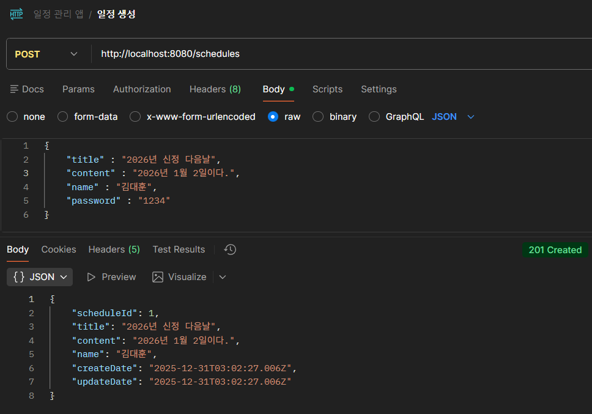
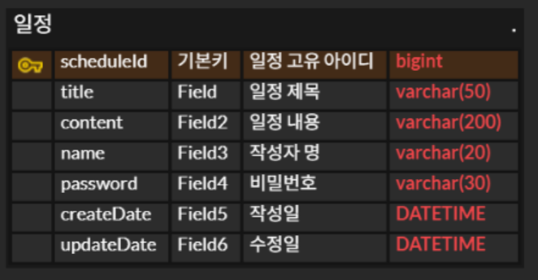
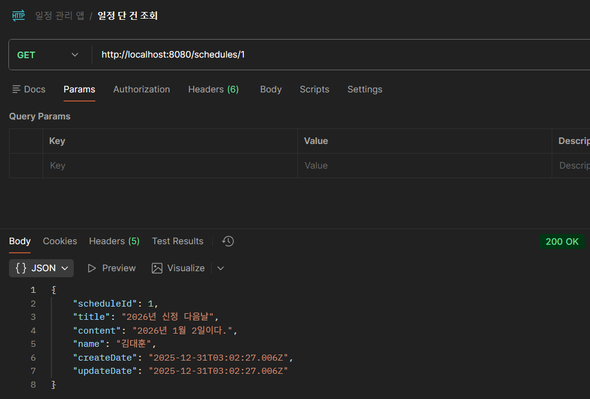
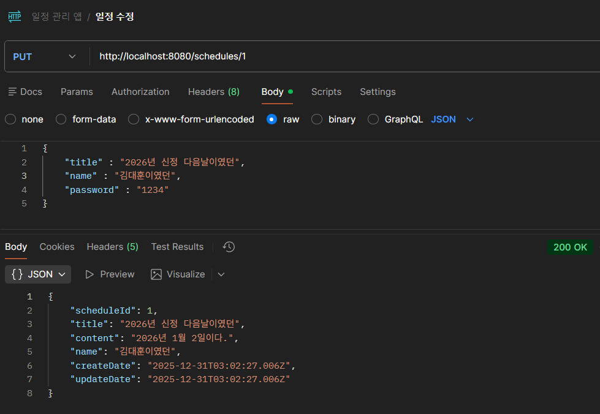
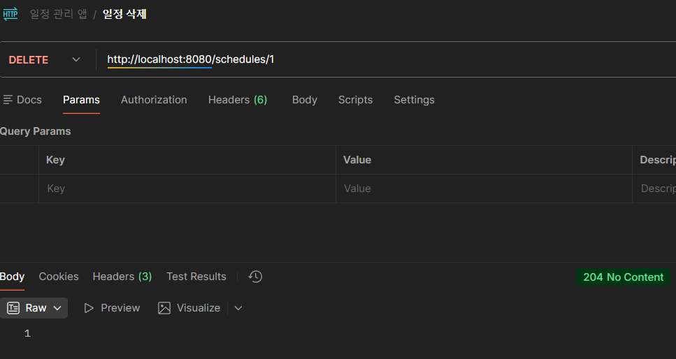
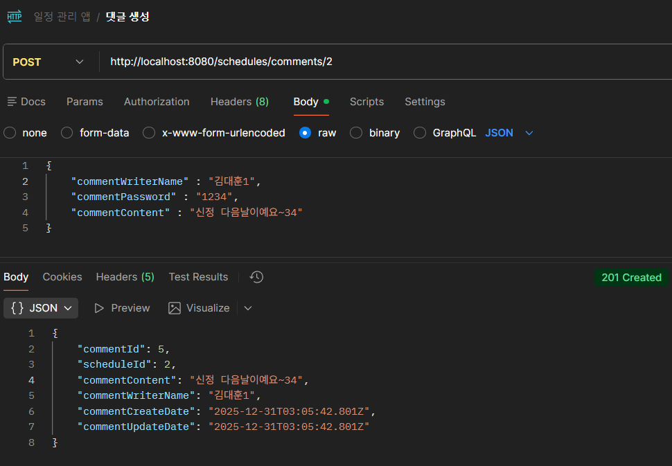
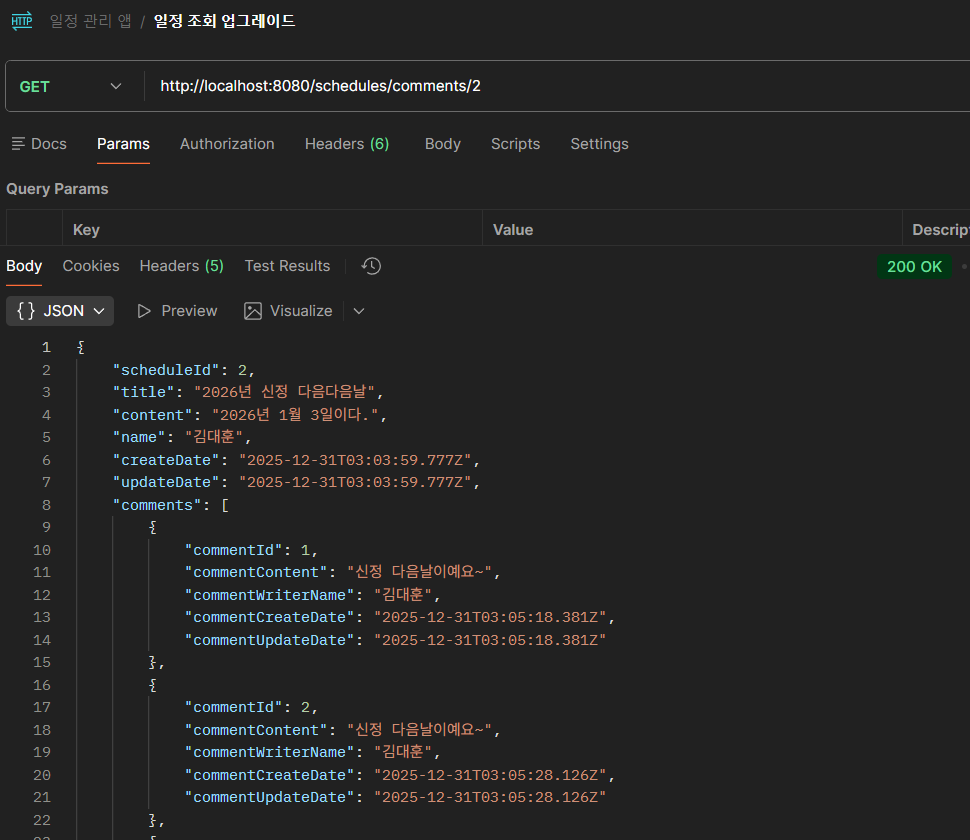

# 일정 관리 앱 만들기
- 작성자 : 김대훈
- 시작 일 : 2025년 12월 29일

## 파일 구조와 진행 방식
각 Lv의 작은 파트(기능)마다 commit 하였고, 커밋 메시지를 통해 해당 기능에 대한 설명 하였습니다. <br>
그리고, 설명이 부가적으로 필요한 기능 같은 경우에는 해당 기능 코드에 주석으로 부가 설명을 덫붙였습니다.

또한 branch는 각 스텝 별로 Lv_1, Lv_2, Lv_3, Lv_4, Lv_5, ...로 각각 나누어서 진행하였습니다.

가장 마지막 문단에 3 Layer Architecture와 @RequestParam, @PathVariable, @RequestBody 어노테이션에 대한 분석글을 작성해 놓았습니다.

## API 명세서
## `일정 생성`

**Request**
- **Method:** POST
- **API 엔드포인트:** POST /schedules
- **Body:**  `title` ,`content`, `name`, `password` 필수 입력

    ```json lines
    {
    	"title" : "2026년 신정",
    	"content" : "2026년 1월 1일이다.",
    	"name" : "김대훈",
    	"password" : "1234"
    }
    ```
- createDate, updateDate는 서버 자동 생성

**Response**
- **Status Code: `201 Created`** 생성 성공
    - **Body**

      **설명:** 서버에서 `scheduleId`가 부여된 완전한 `schedule` 객체를 반환.(password 제외)

    ```json lines
    {
        "scheduleId": 1,
	    "title" : "2026년 신정",
	    "content" : "2026년 1월 1일이다.",
	    "name" : "김대훈",
	    "createDate" : "2025-12-29 15:13:21",
        "updateDate" : "2025-12-29 15:13:21"
    }
    ```

- **Status Code: `400 Bad Request`** 요청 오류
    - **Body:**

      **설명:**   필수 필드가 누락된 경우 발생.

    ```json
    {
      "message": "일정 제목, 일정 내용, 작성자명, 비밀번호는 필수 입력입니다."
    }
    ```

## `전체 일정 조회`

**Request**
- **Method:** GET
- **API 엔드포인트:** GET /schedules

**Response**
- **Status Code: `200 OK`** 조회 성공
    - **Body**

      **설명:** `schedule` 객체를 반환. 없으면 빈 배열`[]` 반환.(password 제외)

    ```json lines
    [
      {
           "scheduleId": 1,
           "title" : "2026년 신정",
	       "content" : "2026년 1월 1일이다.",
	       "name" : "김대훈",
	       "createDate" : "2025-12-29 15:13:21",
           "updateDate" : "2025-12-29 15:13:21"
       },
       {
           "scheduleId": 2,
           "title" : "2026년 크리스마스",
	       "content" : "2026년 12월 25일이다.",
	       "name" : "김대훈",
	       "createDate" : "2025-12-29 15:13:21",
           "updateDate" : "2025-12-29 15:13:21"
       }
    ]
    ```

- **Status Code: `500 Internal Server Error`** 서버 내부 오류
    - **Body:**

      **설명:**   서버 오류

    ```json
    {
      "message": "요청을 처리하는 중 서버에서 오류가 발생했습니다."
    }
    ```

## `선택 일정 조회`

**Request**
- **Method:** GET
- **API 엔드포인트:** GET /schedules/{scheduleId}
- **Path Parameters:** key: scheduleId, Type: Long, 필수 -> 일정의 각 고유 ID로 조회

**Response**
- **Status Code: `200 OK`** 조회 성공
    - **Body**

      **설명:** 해당하는 scheduleId의 `schedule` 객체를 반환.(password 제외)

    ```json lines
      {
           "scheduleId": 1,
           "title" : "2026년 신정",
	       "content" : "2026년 1월 1일이다.",
	       "name" : "김대훈",
	       "createDate" : "2025-12-29 15:13:21",
           "updateDate" : "2025-12-29 15:13:21"
       }
    ```

- **Status Code: `404 Not Found`** 리소스 없음
    - **Body:**

      **설명:**   파라미터로 받은 scheduleId가 존재하지 않을 경우

    ```json
    {
      "message": "해당 일정을 찾을 수 없습니다."
    }
    ```

- **Status Code: `500 Internal Server Error`** 서버 내부 오류
    - **Body:**

      **설명:**   서버 오류, 파라미터로 받은 scheduleId가 존재하지 않을 경우

    ```json
    {
      "message": "요청을 처리하는 중 서버에서 오류가 발생했습니다."
    }
    ```


## `일정 수정`

**Request**
- **Method:** PUT
- **API 엔드포인트:** PUT /schedules/{scheduleId}
- **Path Parameters:** key: scheduleId, Type: Long, 필수
- **Body:**  `title` , `name`입력 `password` 필수 입력

    ```json lines
    {
    	"title" : "2026년 신정 다음 날",
    	"name" : "김대훈2",
    	"password" : "1234"
    }
    ```


**Response**
- **Status Code: `200 OK`** 수정 성공
    - **Body**
      **설명:** 해당하는 `scheduleId`의 수정된 객체 반환(수정일 현 시간으로 변경)
    ```json lines
      {
           "scheduleId": 1,
           "title" : "2026년 신정 다음 날",
	       "content" : "2026년 1월 1일이다.",
	       "name" : "김대훈2",
	       "createDate" : "2025-12-29 15:13:21",
           "updateDate" : "2025-12-30 00:00:00"
       }
    ```

- **Status Code: `401 Unauthorized`** 비밀 번호 오류
    - **Body:**

      **설명:**   비밀 번호가 틀렸을 경우

    ```json
    {
      "message": "비밀번호가 맞지 않거나 해당 일정을 찾을 수 없습니다."
    }
    ```

- **Status Code: `404 Not Found`** 리소스 없음
    - **Body:**

      **설명:**   파라미터로 받은 scheduleId가 존재하지 않을 경우

    ```json
    {
      "message": "해당 일정을 찾을 수 없습니다."
    }
    ```


- **Status Code: `500 Internal Server Error`** 서버 내부 오류
    - **Body:**

      **설명:**   서버 오류, 파라미터로 받은 scheduleId가 존재하지 않을 경우

    ```json
    {
      "message": "요청을 처리하는 중 서버에서 오류가 발생했습니다."
    }
    ```

## `일정 삭제`

**Request**
- **Method:** DELETE
- **API 엔드포인트:** DELETE /schedules/{scheduleId}
- **Path Parameters:** key: scheduleId, Type: Long, 필수
- **Body:** `password` 필수 입력
    ```json lines
    {
    	"password" : "1234"
    }
    ```
**Response**
- **Status Code: `204 No Contents`** 삭제 성공

  **설명:** 해당하는 scheduleId의 일정 삭제


- **Status Code: `401 Unauthorized`** 비밀 번호 오류
    - **Body:**

      **설명:**   비밀번호가 틀렸을 경우

    ```json
    {
      "message": "비밀번호가 맞지 않거나 해당 일정을 찾을 수 없습니다."
    }
    ```


- **Status Code: `404 Not Found`** 리소스 없음
    - **Body:**

      **설명:**   파라미터로 받은 scheduleId가 존재하지 않을 경우

    ```json
    {
      "message": "해당 일정을 찾을 수 없습니다."
    }
    ```


- **Status Code: `500 Internal Server Error`** 서버 내부 오류
    - **Body:**

      **설명:**   서버 오류, 파라미터로 받은 scheduleId가 존재하지 않을 경우

    ```json
    {
      "message": "요청을 처리하는 중 서버에서 오류가 발생했습니다."
    }
    ```

## `댓글 생성`

**Request**
- **Method:** POST
- **API 엔드포인트:** POST /schedules/comments/{scheduleId}
- **Path Parameters:** key: scheduleId, Type: Long, 필수
- **Body:**  `commentWriterName` ,`commentPassword`, `commentContent` 필수 입력

    ```json lines
    {
    	"commentWriterName" : "김대훈",
    	"commentPassword" : "1234",
    	"commentContent" : "2026년 새해 복 많이 받으세요~",
    }
    ```
- commentCreateDate, commentUpdateDate는 서버 자동 생성

**Response**
- **Status Code: `201 Created`** 생성 성공
    - **Body**

      **설명:** 서버에서 `commentId`가 부여된 완전한 `comment` 객체를 반환.(password 제외)

    ```json lines
    {
        "commentId": 1,
	    "scheduleId" : 1,
	    "commentContent" : "2026년 새해 복 많이 받으세요~",
	    "commentWriterName" : "김대훈",
	    "commentCreateDate" : "2025-12-29 15:13:21",
        "commentUpdateDate" : "2025-12-29 15:13:21"
    }
    ```

- **Status Code: `400 Bad Request`** 요청 오류
    - **Body:**

      **설명:**   필수 필드가 누락된 경우 발생.

    ```json
    {
      "message": "일정 제목, 일정 내용, 작성자명, 비밀번호는 필수 입력입니다."
    }
    ```


## ERD


## PostMan 실행 결과
- 일정 생성

- 일정 전체 조회

- 일정 단 건 조회
  

- 일정 수정
  

- 일정 삭제
  

- 댓글 생성
  

- 일정 조회 업그레이드
  


## 3 Layer Architecture(Controller, Service, Repository) 적용 여부와 필요성
3 Layer Architecture를 패키지 별로 나누어서 진행 하였습니다. <br>
이번 과제를 진행하며 3가지 계층에서 크게 와닿은 특징은
Controller 계층에선 HTTP 요청을 매핑해주는 역할을 하고, Service 계층에서는 비즈니스 로적을 처리하고, Repository에서는 데이터베이스와 쿼리메소드를 통해 상호작용을 하는 역할을 하였습니다.
<br> <br>
물론 지금은 간단한 CRUD만 구현하는 것에 그쳤지만, 이러한 계층이 없다면 이번 과제처럼 간단한 CRUD 조차도 가독성이 너무 떨어져
코드 수정이나, 재사용 하기가 정말 힘들 것 같고, 기본적인 틀안에서 코드를 작성하다 보니, 뭐부터 해야하지? 라는 막막함이 덜 했던 것 같습니다.
<br><br>
Repository 계층에서 쿼리 메소드를 통해 데이터 베이스 쿼리문을 한줄로 쭉 나타내는데 이러한 방식이 너무 신기하고, 되게 간편하긴 하지만
정확히 이게 어떠한 방식으로 동작하는지 깨닫지는 못했습니다. 제 느낌상 그냥 메소드 명에 필드 명을 적었을 뿐인데 어떻게 데이터가 타입도
보지않고, 매핑이 되어서 쿼리문을 수행하는지 의문이였던 것 같습니다.


## @RequestParam, @PathVariable, @RequestBody 어노테이션의 정의와 특성
`@RequestParam`은 쿼리 파라미터, `@PathVariable`는 경로 변수, `@RequestBody`는 요청 본문입니다.
<br><br>
`@RequestParam`은 키/값 구조로 받아오며 `required=false`로 옵션을 설정한다면, 필수값 조건이 없어져 있든 말든 상관 없게 됩니다. <br>
이를 이용해서 `GET/schedules?name=김대훈` 와 같은 쿼리 파라미터(?Key=Value)를 사용해 작성자가 김대훈인 schedule을 찾을 수 있습니다.<br>
이번 과제에서는 `@RequestParam`은 로직을 어떻게 구성해야하는 지 헷갈려 개념이 확실하게 잡힌 `@PathVariable`로 썼지만,
지금 생각해보니 댓글을 포함한 일정을 조회할 때나, 단건 조회 시 `@RequestParam`을 사용하면 더 좋았을 것 같습니다.
<br><br>
`@PathVariable`는 URL 경로 자체에 값이 포함되어 엔드포인트를 구성하기 때문에 반드시 값이 들어와야합니다.
앞서 설명한 `@RequestParam`은 쿼리 파라미터가 없어도 API 자체에 영항을 끼치지 않지만, `@PathVariable`은 없으면 아예 다른 API가 됩니다.
<br><br>
`@RequestBody`는 HTTP 요청 예를 들어 JSON 형식의 데이터가 들어 왔을 때, DTO 패키지안의 Request 객체를 이용하여 값을 매핑하는 기능을 수행합니다.
