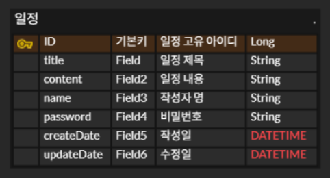

# 일정 관리 앱 만들기
- 작성자 : 김대훈
- 시작 일 : 2025년 12월 29일

## 파일 구조와 진행 방식
commit 에 대한 진행 방식은 각 step의 작은 파트(기능)마다 commit 하였고,
커밋 메시지를 통해 해당 기능에 대한 설명 하였습니다. 그리고, 설명이 부가적으로 필요한 기능 같은 경우에는
해당 기능 코드에 주석으로 부가 설명을 덫붙였습니다.

또한 branch는 각 스텝 별로 step_1, step_2, step_3, step_4, step_5_1, step_5_2, step_5_3로 각각 나누어서 진행하였습니다.

## API 명세서
### 일정 생성

**Request - 요청**
- **Method:** POST
- **API 엔드포인트:** POST /calender
- **Body:**  `name` ,`address` 필수 입력

    ```jsx
    {
    	"title" : "2026년 신정",
    	"content" : "2026년 1월 1일이다.",
    	"name" : "김대훈",
    	"password" : "",
    	"createDate" : "2025-12-29 00:00:00"
        "updateDate" : "2025-12-29 00:00:00"
    }
    ```


**Response**

- **Status Code: `201 Created`** 생성 성공
    - **Body**

      **설명:** 서버에서 `id`가 부여된 완전한 `place` 객체를 반환.


    ```json
    {
        "id": 809,
        "name": "명동 교자 본점",
        "address": "서울 중구 명동10길 29 1층",
        "call": 02-776-5348,
        "category": "한식",
        "rating": 5
    }
    ```

- **Status Code: `400 Bad Request`** 요청 오류
    - **Body:**

      **설명:**   `name` , `address` 필수 필드가 누락된 경우 발생.


    ```jsx
    {
      "message": "이름, 주소는 필수 입력 값 입니다."
    }
    ```

- **Status Code: `500 Internal Server Error`**  서버 내부 오류
    - **Body:**


## ERD 다이어 그램
